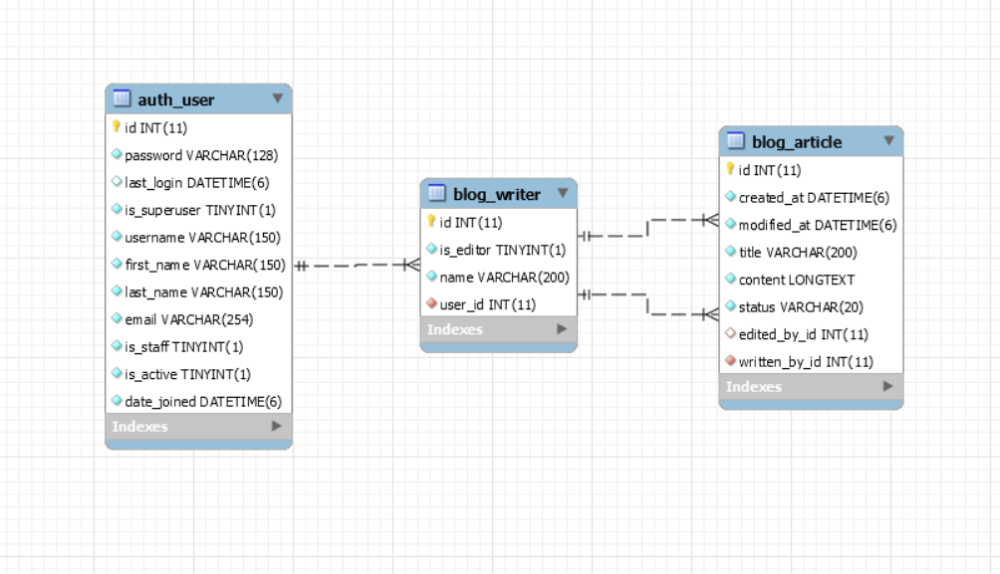

# linkgraph the toy project 

### Start the project
    django-admin startproject blogtoy ./

### Run the app 
    python manage.py runserver

### Migrations 
    python manage.py migrate
    python manage.py makemigrations

### Create super user
    python manage.py createsuperuser --username=admin --email=admin@gmail.com

## Entity Relation Model 

_____

Article
* created_at
* title
* content
* status
* written_by (Writer)  
* edited_by (Writer)    
____
Writer
* is_editor (boolean)
* name
___
User
- connected to Django User auth model

### Query for get writter details 
    with one as (select written_by, count(written_by) last_30 from blog_article  where created_at > date('now','-30 days') GROUP by written_by)
    select blog_article.written_by, count(blog_article.written_by) total_articles, one.last_30 from blog_article  
    inner join one on one.written_by = blog_article.written_by

### Topics to Cover 

* Inheritances Templates.
* Model 
* Autentication User 
https://docs.djangoproject.com/en/3.1/topics/auth/default/
For authenticate with user a pass

* Handle Page Not Found. 
https://medium.com/@yildirimabdrhm/python-django-handling-custom-error-page-807087352bea

* Pipes 
https://help.klaviyo.com/hc/en-us/articles/115005257788-How-to-Format-Date-Variables-in-Templates